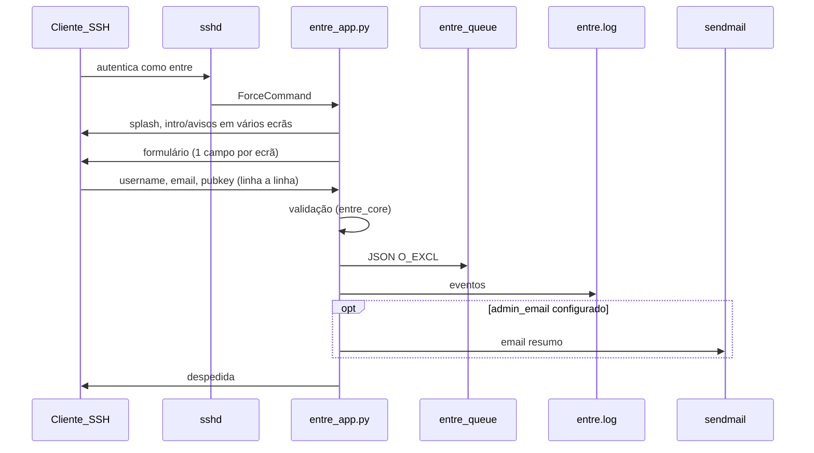

# Arquitectura — módulo `terminal` (entre SSH)

Instalação e uso operacional: **[USO.md](USO.md)**.

## Fluxo ponta a ponta

## Componentes

| Peça | Papel |
|------|--------|
| `entre_app.py` | Orquestra etapas, I/O terminal, confirmação. |
| `entre_core.py` | Config TOML, validação (alinhada ao `create_runv_user.py`), escrita atómica do JSON, logging, `sendmail`. |
| `setup_entre.py` | Bootstrap: utilizador `entre`, árvore em `/opt/runv/terminal`, permissões, snippet SSH impresso. |
| `templates/*.txt` | Conteúdo editável sem alterar código. |
| `systemd/*.path` + `*.service` | Gatilho opcional em alterações da fila. |

## Decisões de segurança

- **Sem `shell=True`:** `subprocess.run([...], ...)` apenas com listas literais.
- **Sem criação de utilizadores** no `entre_app.py` / `entre_core.py`.
- **Sem alteração de Apache ou sshd** pelo código de aplicação.
- **Fila:** criação com `O_CREAT|O_EXCL` para não sobrescrever ficheiros existentes.
- **Entrada:** limites de tamanho; chave numa linha; rejeição de marcadores de chave privada.
- **SSH:** `DisableForwarding` e afins recomendados no `Match User entre` para limitar túneis e agent forwarding.
- **Utilizador `entre`:** shell `nologin` reduz superfície se alguma configuração falhar (ainda assim, o essencial é o `ForceCommand` correcto).

## Por que a conta não é criada na hora

- **Revisão humana:** pubnix/tilde costuma evitar contas automáticas abertas a abuso.
- **Coerência com o projeto:** o provisionamento oficial e quotas/metadata estão centralizados em `create_runv_user.py`.
- **Auditoria:** JSONs imutáveis na entrada (novo `request_id` por tentativa gravada) facilitam rastrear o que foi pedido.

## Pontos de extensão futura

- Campo opcional “mensagem ao admin” no JSON.
- Script que promove `pending` → `approved` e chama `create_runv_user.py`.
- Notificação via webhook ou Matrix no `runv-entre-notify.service`.
- Base de dados: substituir fila por tabela **mudaria** este módulo; hoje é deliberadamente ficheiro-only.

## Alinhamento com `create_runv_user.py`

Regex de username/email, tipos de chave e normalização da linha pública seguem a mesma filosofia que [`scripts/admin/create_runv_user.py`](../../scripts/admin/create_runv_user.py). O código **não** importa esse ficheiro em runtime (evita dependência de path do repositório em `/opt/runv/terminal`); comentários no código referem a necessidade de manter políticas sincronizadas.
